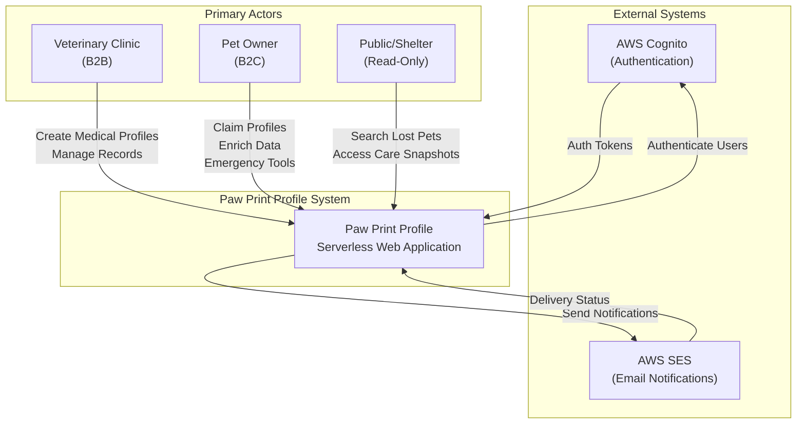
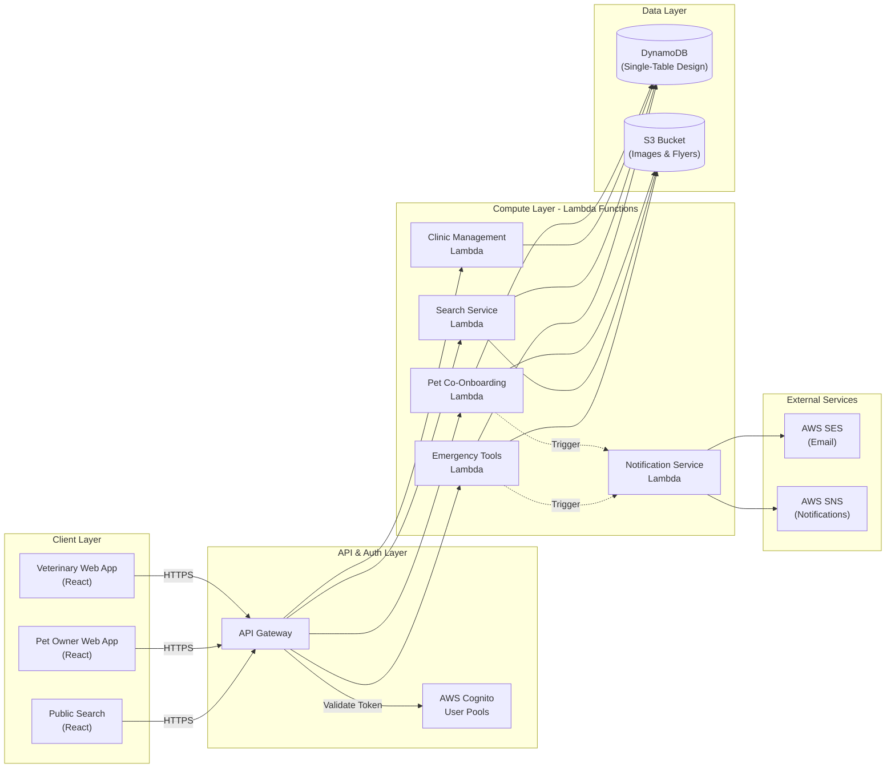
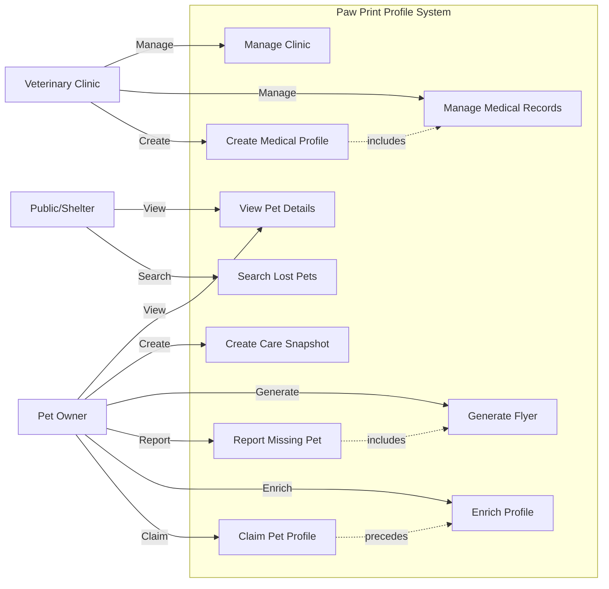

# Design Document: Paw Print Profile

### Co-Onboarding Model

The system implements a two-phase onboarding process:

1. **Medical Onboarding (B2B)**: Veterinary clinics create initial medically verified pet profiles during routine visits, establishing the foundation of accurate medical data
2. **Owner Claiming (B2C)**: Pet owners claim profiles created by veterinarians using claiming codes, then enrich them with personal information and photos

### User Roles and Access Levels

- **Primary (B2B) - Veterinary Clinics**: Create medically verified pet profiles, manage medical records, and provide claiming codes to pet owners
- **Secondary (B2C) - Pet Owners**: Claim vet-created profiles, enrich with personal data, and utilize emergency tools for lost pet scenarios  
- **Extended (Read-Only) - Public/Shelters/Caregivers**: Access controlled information through public search, care snapshots, or emergency flyers

The system emphasizes developer experience by providing automatic environment detection that seamlessly switches between LocalStack (local) and AWS (cloud) without code changes, supporting both MVP development constraints and post-launch scalability requirements.

## Architecture

### System Context Diagram (Level 1)

The System Context Diagram defines the external boundaries of the Paw Print Profile application. It illustrates the B2B2C interaction model, distinguishing between the data-creation role of Veterinary Clinics, the management role of Pet Owners, and the read-only consumption role of Public Users. Furthermore, it outlines external dependencies, specifically delegating authentication to AWS Cognito and notification delivery to AWS SES.

### Component Architecture Diagram (Level 2)

This Component Architecture Diagram illustrates the internal structural design of the system using an AWS Serverless paradigm. The client-side React applications interface with Amazon API Gateway, which securely routes traffic to domain-specific Lambda compute functions. State persistence is handled via a single-table Amazon DynamoDB design, while heavy binary assets, such as pet images and generated missing flyers, are stored in Amazon S3.

### Use Case Diagram

The Use Case Diagram maps the functional requirements to their authorized actors, highlighting the strict separation of concerns within the Co-Onboarding model. It visualizes how the initial "Medical Profile Creation" is securely restricted to the Veterinary Clinic, while the subsequent "Profile Claiming," "Enrichment," and "Flyer Generation" are exclusively handed over to the Pet Owner.

## Summary

This design document provides a comprehensive blueprint for Paw Print Profile, a B2B2C serverless web application that facilitates veterinary pet information management through a co-onboarding model. The architecture leverages AWS serverless services for scalability and cost-effectiveness, while Docker and LocalStack enable efficient local development and testing within academic project constraints.

### Key Design Features

**Co-Onboarding Model**: The system implements a two-phase onboarding process where veterinary clinics create medically verified pet profiles, and pet owners claim and enrich these profiles, ensuring data accuracy while enabling personalization.

**Controlled Access**: The system provides three levels of access - primary B2B (veterinary clinics), secondary B2C (pet owners), and extended read-only access (public, shelters, caregivers) - enabling comprehensive pet care coordination while maintaining data security.

**Environment Flexibility**: Automatic environment detection ensures seamless transitions between local development (LocalStack) and cloud deployment (AWS) without code changes, supporting both academic development and production scalability.

